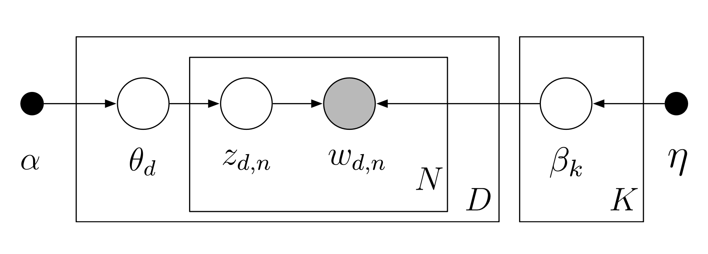

```{r setup, include=FALSE, message=FALSE, warning=FALSE}
knitr::opts_chunk$set(echo = TRUE, cache = FALSE)
library(reticulate)
# Use the enron conda environment for Python
use_condaenv("enron", conda = "/Users/nmacdonald/mambaforge3/bin/conda")
```

# Natural Language Processing

Natural Language Processing (NLP) definition 

# Topic Modeling

Extracting various concepts or topics from a large corpus such as the Enron emails can be performed using topic modeling.

Topic modeling extracts features to generate clusters or groups of terms that are distinguishable from one another.
Clusters of words form topics, which can be used to understand the main themes of a corpus.

- Latent semantic indexing (LSI)
- Latent Dirichlet allocation (LDA)
- Non-negative matrix factorization

First 2 methods are popular and have been around a long time.
Non-negative matrix factorization is a newer method that is extremely effective and provides good results.

[Text Analytics with Python Ch. 5 LDA](https://learning.oreilly.com/library/view/text-analytics-with/9781484223871/A427287_1_En_5_Chapter.html)


## Background

LDA is a three-level generative model for collections of discrete data such as text corpora.
The basic idea is that documents are represented as random mixtures over latent topics, 
where each topic is characterized by a distribution over words.
Each email in the database is a document, and the corpus is a collection of documents.
A document or email is a sequence of $N$ words.
LDA assumes that each email (document) exhibits $K$ topics.
It is important to note that the only observed variables are the words of the documents while 
topic related data are latent variables [@hoffman2013stochastic].

A graphical representation of the LDA model 
is shown in Figure 1 [@hoffman2013stochastic].
The model considers observations are the words, organized in the documents.
The $n$th word in the $d$th document is $w_{d,n}$.
Each word is an element in a fixed vocabulary of $V$ terms.
A topic $\beta_k$ is a distribution over the vocabulary.
In LDA there are $K$ topics, and each topic $k$ is a word distribution over the $V$ terms.
Each doument in the database is associated with a vector of topic proportions $\theta_d$.
Topic proportions are a distribution over topics, drawn from a Dirichlet distribution.
Each word in each document is assumed to have been drawn from a single topic.
The topic assignment for the $n$th word in the $d$th document is $z_{d,n}$.

```{r lda-graphical-model, echo=FALSE, out.width="70%", fig.cap="Graphical Model of LDA", fig.align = "center"}

```

## Data Wrangling

The Enron email dataset is loaded and parsed to extract the text content of the emails.

- Data Wrangling
    - Downloading and saving to database
    - Format the date

## Pre-Processing

The text content of the emails is pre-processed to remove stop words, punctuation, and other non-essential information.

### Text Extraction

The text content of the emails is extracted from the database and stored in a pandas DataFrame.
This issue with the text, or body of each email, is the amount of insignificant data that is included.
The insignificant data adds noise to the dataset and can be removed to improve the quality of the data.
Text extraction is performed to remove the email headers, footers, and other non-essential information.

HTML tags are removed from the email text using the `BeautifulSoup` library.
The `BeautifulSoup` library is a Python package that is used to parse HTML and XML documents.
The `get_text()` method is used to extract the text content from the email body.

In addition, email addresses and URLs are removed from the email text using regular expressions.
Email addresses are stored in additional columns of the dataframe, thus they will not neglect the email text
when removed from the body of the email, and they are still available for analysis if needed.
URLs are also removed from the email text using regular expressions in an effort to allow the topic model
to focus on the content of the emails.

### Normalization

Text normalization is performed to convert the text to lowercase and remove punctuation.
The `str.lower()` method is used to convert the text to lowercase.
Non-alphabetic characters are filtered out of the text using the `re.sub()` method with
a regular expression pattern that matches non-alphabetic characters, `[^a-z\s]`.

### Tokenization

Tokenization is the process of splitting text into smaller units called tokens, 
which are often words but can also be phrases or even characters depending on the context. 
In this case, the text is being split into individual words, where
each word in the sentence becomes a separate token.
Tokenization is important as you cannot assume all text is useful to extract
features from, and including the entirety of the email bodies will add more 
noise to the data set [@beysolowNLP2018].

Using the function `word_tokenize` from the Natural Language Toolkit (NLTK) library,
text or strings are split into a list of words known as tokens.
Using NLTK allows for less pre-processing, as it is capable of recognizing punctuation and contractions.
The tokenized text from each email body is stored in a pandas DataFrame column labeled `"processed_text"`.
The tokenized text is then used for further pre-processing steps.

### Removing Stop Words

Utilizing the tokenized text, stop words are removed from the email content.
Stop words are common words that do not add value to the analysis, such as "the", "and", or "is".
The `stopwords` module from the NLTK library is used to remove stop words from the tokenized text,
considering the English dictionary.

### Stemming

Stemming is performed with the `PorterStemmer` class from the NLTK library.
Stemming is the process of reducing words to their root or base form.
The `PorterStemmer` class is used to stem the tokenized text, which reduces the number of unique words in the corpus.

## Topic Modeling

To develop an LDA model with Python, the scikit-learn library can be utilized [@scikit-learn].
The scikit-learn package includes unsupervised learning with matrix decomposition algorithms.
Under this umbrella is the `LatentDirichletAllocation` class, which is used to fit the LDA model to the Enron email dataset.
LDA modeling can be performed by using the application programming interface (API) provided by scikit-learn [@scikit-learn-API]
to access the `sklearn.decomposition` module that includes the `LatentDirichletAllocation` class.

`LatentDirichletAllocation` implements the online variational Bayes algorithm and is used with the batch update method. 
The batch method updates variational variables after each full pass through the data and is implemented by 
`learning_method='batch'` [@scikit-learn-lda].

- Topic Modeling
    - Final preparation
    - Top topics, top words for each topic
    - Wordcloud plot

To develop a topic model, the data must be prepared as previously discussed for pre-processing.
The `LatentDirichletAllocation` class is then used to fit the LDA model to the Enron email dataset.
The text from each email body is employed with the topic model that has been pre-processed using 
text extraction, normalization, tokenization, stop word removal, and stemming.
The final step to prepare the data for the LDA model is to convert the tokenized text to a document-term matrix.
The `CountVectorizer` class from the scikit-learn library is used to convert the tokenized text to a document-term matrix.
The document-term matrix is a matrix that describes the frequency of terms that occur in a collection of documents.
An LDA model is then fit to the document-term matrix to generate topics from the Enron email dataset, where
the number of topics is specified as a parameter (e.g., `n_components=10`).

With results from the LDA model, the top topics and top words for each topic can be extracted.
A function is developed to extract the top topics and top words for each topic from the LDA model.
The function sorts the topics by the highest probability and extracts the top words for each topic.
The top topics and top words for each topic are then displayed in a table format.

## Dynamic Topic Modeling
